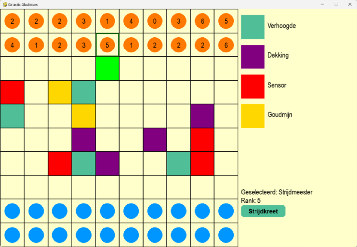

# Galactic Gladiators - Eindopdracht Python
## 1. Wat is de opdracht?

"Galactic Gladiators" is een digitaal strategisch bordspel waarbij spelers het bevel hebben over een leger van eenheden met als doel de vlag van de tegenstander te veroveren. Verderop worden de regels beschreven. De opdracht is om hier een applicatie van te bouwen met Flask, PyGame of Arcade.

---

## 2. Galactic Gladiators

### 2.1 Spelregels en spelverloop

"Galactic Gladiators" is een strategisch, turn-based bordspel waarin spelers (één menselijke speler en één AI) commandanten zijn van rivaliserende legers op een extra-galactische planeet. Het doel is om de vlag van de tegenstander te veroveren. Dit spel combineert strategische plaatsing, gebruik van speciale krachten, voorspelling van de acties van de tegenstander en een vleugje geluk.

### Speelbord

Het spel wordt gespeeld op een vast bord van **10x10 vakjes**. De 'human'- en AI-spelers positioneren hun eenheden op respectievelijk de bovenste twee rijen en onderste twee rijen van het bord.

Op de middelste vier rijen worden op random vakjes de volgende **speciale elementen** geplaatst:

1. **Verhoogde positie** (aantal: 3)
   - Eenheden op een verhoogde positie krijgen +1 bij hun rang opgeteld tijdens een gevecht.

2. **Dekking** (aantal: 2)
   - Eenheden op een dergelijk vakje zijn niet vatbaar voor speciale krachten.

3. **Sensor** (aantal: 4)
   - Deze vakjes met sensoren onthullen de typen van eenheden die er op staan. Als ze van dit vakje afgaan, wordt het type weer verborgen.

4. **Goudmijn** (aantal: 3)
   - Elke drie aaneengesloten beurten dat de goudmijn door een specifieke eenheid bezet wordt gehouden, levert dit één goudstuk voor de bijbehorende speler op.

*Figuur 1: Voorbeeld van een mogelijke GUI*
### Startopstelling

Aan het begin van het spel positioneren beide spelers hun eigen eenheden op het bord. De opstelling is **geheim** voor de tegenstander; je ziet wel dat er een eenheid staat, maar niet van welk type en rang de eenheid is. De speciale elementen zijn zichtbaar voor beide spelers. Het spel kan beginnen als beide spelers de twee rijen gevuld hebben met hun leger.

### Soorten eenheden en hun krachten

1. **Verkenner** (aantal: 3, rang: 1)
   - **Speciale kracht:** "Infiltratie" - Eenmalig gebruik om zich onzichtbaar te maken voor drie beurten. Als een vijandelijke eenheid op het vakje van deze onzichtbare verkenner stapt, is de vijandelijke eenheid uitgeschakeld (ongeacht de rang) en verdwijnt deze vijandelijke eenheid van het bord, de verkenner wordt weer zichtbaar.

2. **Infanterist** (aantal: 7, rang: 2)
   - Soldaten hebben geen speciale kracht.

3. **Scherpschutter** (aantal: 3, rang: 3)
   - **Speciale kracht:** "Precisieschot" - Eenmalig gebruik om een vijandelijke eenheid op afstand van maximaal 4 vakjes uit te schakelen. Om de aanval te laten slagen, wordt er met een dobbelsteen gegooid. Is de uitkomst 5 of 6, dan slaagt de aanval en is de vijandelijke eenheid uitgeschakeld. Als deze kracht wordt gebruikt, ongeacht de uitkomst van het dobbelen, is de scherpschutter zelf uitgeschakeld en verdwijnt van het bord.

4. **Schilddrager** (aantal: 2, rang: 4)
   - **Speciale kracht:** "Energieveld" – Eenmalig gebruik om alle vijandelijke speciale krachten voor drie beurten te negeren. Als de kracht gebruikt wordt om een vijandelijke speciale kracht tegen te houden, wordt de schilddrager bekend bij de tegenstander.

5. **Strijdmeester** (aantal: 2, rang: 5)
   - **Speciale kracht:** "Strijdkreet" – Geeft aangrenzende eenheden (in horizontale en verticale richting, niet diagonaal) een rangbonus van +1 voor één beurt.

6. **Commando** (aantal: 2, rang: 6)
   - **Speciale kracht:** "Sabotage" – Kan een aangrenzende vijandelijke eenheid saboteren, waardoor de eenheid deel wordt van het eigen leger.

7. **Vlag** (aantal: 1, rang: 0)
   - De vlag heeft geen speciale kracht en kan ook niet bewegen.

### Spelverloop

Beide spelers zien hun eigen eenheden en hun type en rang. Alle vakjes zijn zichtbaar, maar je weet niet welke eenheden van de tegenstander op een vakje staan totdat je de specifieke eenheid aanvalt. Na een aanval is het type van de vijandelijke eenheid voor één beurt zichtbaar.

Als de vlag van één van de spelers veroverd is door deze aan te vallen, dan is het spel afgelopen. Het veroveren van de vlag zelf levert **tien goudstukken** op. Elke eenheid op het bord levert een speler één extra goudstuk op. De speler met aan het einde het meeste goudstukken, wint het spel.

Het spel wordt gespeeld in rondes, waarbij spelers om de beurt slechts één van de volgende **drie acties** uitvoeren:

- **Bewegen:** Beweeg een eenheid naar een aangrenzend vakje (alleen horizontaal of verticaal, niet diagonaal). Er mag alleen bewogen worden naar een leeg vakje.
- **Aanval:** Een aanval kan gedaan worden als er een vijandelijke eenheid in een aangrenzend vakje staat. Er wordt dan een gevecht gestart, waarbij de eenheid met de hoogste rang (na optelling van speciale krachten) wint. De verliezende eenheid wordt onthuld en toegevoegd aan de uitgeschakelde eenheden.
- **Speciale kracht:** Gebruik een specifieke speciale kracht van een nog actieve eenheid.

---

## 3. Applicatie
Voor de implementatie mag je kiezen tussen een webapplicatie met behulp van **Flask**, of een desktopapplicatie met behulp van **PyGame** of **Arcade**.

In deze applicatie is het mogelijk:
- een nickname aan te geven
- het gehele spel te spelen zoals hierboven beschreven staat tegen een AI
- een opgeslagen spel in te laden en verder te spelen

Aan het einde van het spel toont de applicatie de winnaar aan de hand van de gewonnen goudstukken. Daarnaast worden alle eenheden zichtbaar gemaakt op het bord.

### Functionele eisen

1. Het gehele spel is te spelen, zoals beschreven in sectie 2. Er is een "werkende" tegenstander die vijandelijke eenheden bestuurt. Maak de "AI"-speler zo slim, realistisch of menselijk zoals je dat zelf wil (van random beweging en acties tot volledig geleerde acties aan de hand van machine learning).

2. Sla een spel automatisch op met relevante gegevens om verder te kunnen spelen. Denk minimaal aan:
   - Wie er speelt (nickname)
   - Wanneer het spel gestart werd
   - De score in goudstukken per speler
   - De huidige bordconfiguratie, inclusief actieve speciale krachten, etc.

3. Sla deze gegevens na elke spelersbeurt op in een database of file, zodat bij het (per ongeluk) afsluiten van het spel of het stoppen van de server, er altijd verder gespeeld kan worden.

4. De speler kan kiezen om een nieuw spel te starten of verder te spelen in een bestaand spel uit een lijst van opgeslagen spellen.

5. Er is verplicht een **cheatcode** aanwezig waarbij alle eenheden compleet zichtbaar worden voor de speler. Deze is in en uit te schakelen middels een simpele toetsencombinatie of in een menu.

6. De applicatie crasht niet.

### 3.1 Technische eisen

1. De applicatie moet worden geschreven in **Python**, met keuze tussen Flask (webapplicatie) of PyGame of Arcade (desktopapplicatie) en bestaat uit louter eigen code.

2. **Object-georiënteerd Ontwerp:**
   - **GameBoard:** Beheert het speelveld en interacties daarop.
   - **Unit:** Abstracte basisklasse voor eenheden, met afgeleide klassen voor elke eenheid. Implementeert eigenschappen zoals rang en speciale krachten.
   - **Player / AIPlayer:** Beheert acties van speler en AI.

3. **Python-specifieke Implementatiedetails:**
   - **Dunder Methods:** Implementeer `__init__`, `__str__`, eventueel `__repr__` en andere handige dunder methods voor spelobjecten.
   - **Properties:** Gebruik voor veilige toegang tot attributen zoals de status van eenheden en de spelvoortgang. Laat dit in minstens één klasse terugkomen.
   - **List Comprehensions:** Gebruik voor efficiënte data-manipulatie, zoals het genereren van mogelijke zetten of het scannen van het bord. Laat dit op minstens één nuttige plek terugkomen.
   - **Decorators:** Gebruik voor functies zoals het valideren van moves of het activeren van speciale krachten en natuurlijk voor logging. Laat dit op minstens één nuttige plek terugkomen. Schrijf je eigen decorator.
   - Alle validatie-logica (plaatsing eenheden, controleren van bewegingen, et cetera) moet aan de serverside gebeuren (in Python dus en niet in JavaScript!)

4. **Persistentie:**
   - Sla de staat van een spel op, zodat er later verder gespeeld kan worden. Dit mag aan de hand van een database (zoals SQLite), maar het opslaan in een bestand, zoals JSON, voldoet ook.

5. **User Interface:**
   - **Flask:** HTML/CSS templates voor het weergeven van de spelinterface, mogelijk aangevuld met JavaScript voor interactieve elementen maar zonder validatie.
   - **PyGame/Arcade:** Ontwerp een GUI die het speelveld en spelstatus duidelijk weergeeft. Denk ook aan welke eenheden er uitgeschakeld zijn en nog "actief" zijn om speciale krachten te gebruiken.

6. **Codekwaliteit en -documentatie:**
   - Zorg voor heldere, onderhoudbare code met alleen de nodige documentatie om de leesbaarheid en begrijpelijkheid te bevorderen. De documentatie mag geen duidelijke Python-concepten toelichten of trivialiteiten geven of herhalen. **Minder is meer.**

---

## 4. Beoordeling

Als resultaat krijg je bij het assessment **"voldaan"** of **"niet voldaan"**.

### 4.1 Wanneer "voldaan"?

Je moet alle bovenstaande functionele eisen zelf hebben gebouwd, met uitzondering van de optionele eis. Het gebruik van AI mag, maar alle code (karakter voor karakter) moet uitgelegd kunnen worden. Het niet kunnen uitleggen van code tijdens het assessment is direct een dealbreaker en resulteert in een "niet voldaan". Let er dus ook op dat beide studenten alle code moeten kunnen uitleggen!

Daarnaast moeten alle technische eisen gevolgd zijn. Mooier en uitgebreider mag natuurlijk altijd.

---
# Rubric
### Functioneel:
| Categorie              | Voldoet als:                                                                                                                                                                    | Criterion Score |
|------------------------|---------------------------------------------------------------------------------------------------------------------------------------------------------------------------------|-----------------|
| Bord + stukken init    | Stukken kunnen geplaatst worden op het bord (hoeft niet per se een interface te zijn om te plaatsen, maar is wel mooi en te waarderen). Wel alleen op de juiste rijen! + uitleg | / 2             |
| Beweging en aanval     | Keuze bij elke beurt wat te doen. Gevechten worden correct afgehandeld. + uitleg                                                                                                | / 2             |
| Speciale krachten      | Speciale krachten van eenheden of vakjes worden goed meegenomen en gebruikt. + uitleg                                                                                           | / 2             |
| Persistentie           | Een spel moet elke beurt opgeslagen worden en verder gespeeld kunnen worden. + uitleg                                                                                           | / 2             |
| Totaal     |                                                                                                              | / 8             |
### Technisch

| Categorie                  | Voldoet als:                                                                          | Criterion Score |
|----------------------------|---------------------------------------------------------------------------------------------------------|-----------------|
| Flask, PyGame of Arcade gebruikt | Juiste framework.                                                                                       | / 2             |
| Classes                    | Complete classes op een goede OO manier geïmplementeerd. Denk aan dunder methods en properties. + uitleg | / 2             |
| Decorator                  | Eigen geschreven decorator ingezet (dus niet een bestaande gebruikt) + uitleg                           | / 2             |
| List comprehension         | Gebruik van comprehensions + goede uitleg                                                               | / 2             |
| Persistentie               | Persistentie van gegeven op een technische manier, zoals een database. + uitleg                         | / 2             |
| Totaal     |                                                                                                              | / 10            |

**Total**: / 18

